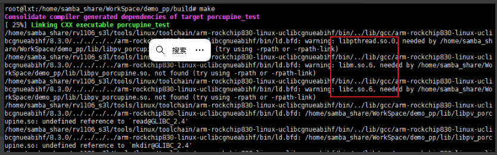
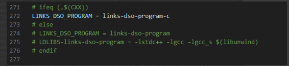

一、porcupine
porcupine不需要进行编译，直接使用源文件提供的库。/(porcupine目录)/lib/linux/x86\_64/libpv\_porcupine.so在x86平台使用，/(porcupine目录)/lib/raspberry-pi/cortex-a7/libpv\_porcupine.so在arm板使用。C用例可参考/(porcupine目录)/demo/c中的porcupine\_demo\_file.c和porcupine\_demo\_mic.c文件。

1.相关文档
官方教程：[https://picovoice.ai/](https://picovoice.ai/)

2.编译问题
1).因为源文件中提供的libpv\_procupine.so是动态库，库需要链接libm.so.6、libc.so.6、libpthread.so.0，上述几个依赖库是libc中的库，rk提供的交叉编译链中使用的是uClibc。


二、libc编译
1.相关文档
libc镜像：[https://mirrors.nju.edu.cn/gnu/libc/](https://mirrors.nju.edu.cn/gnu/libc/)

2.编译命令
``` shell
cd /(libc目录)/;mkdir build;cd build

../configure --host=arm-rockchip830-linux-uclibcgnueabihf --prefix=/home/samba\_share/WorkSpace/glibc/\_install
```

3.编译问题
1).交叉编译时，因为我们编译链使用的uClibc，在编译/(libc目录)/support/links-dso-program.cc的文件时其中的头文件依赖会存在问题，导致报错。


修改/(libc目录)/support/Makefile，在Makefile中使用LINKS\_DSO\_PROGRAM = links-dso-program-c，去编译c文件，不编译c++文件。
