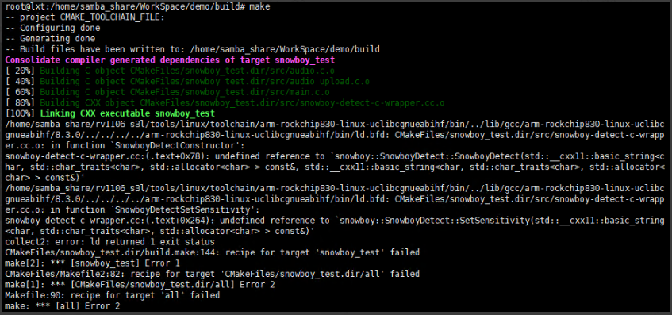
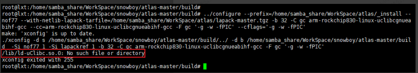
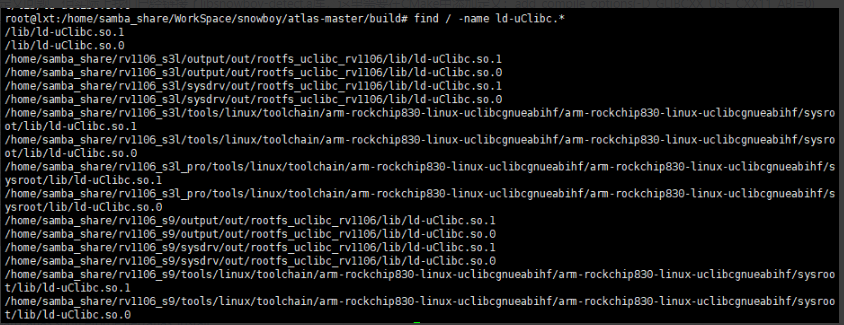
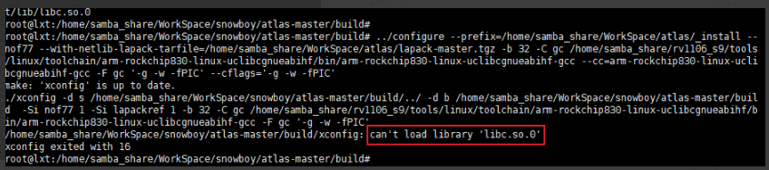
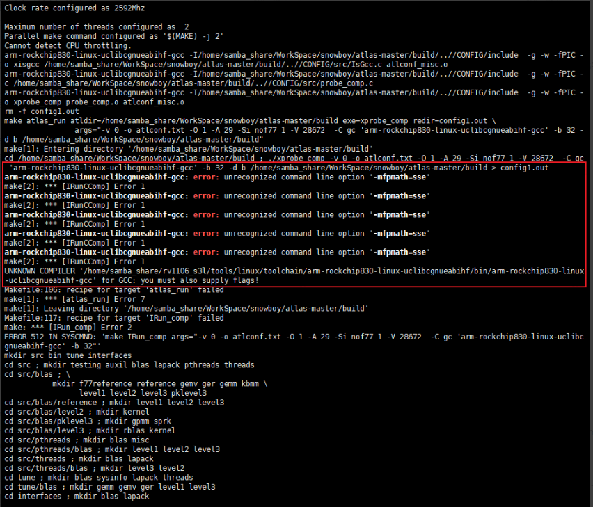
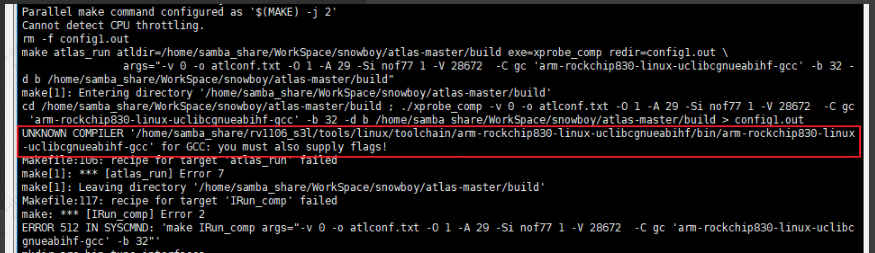
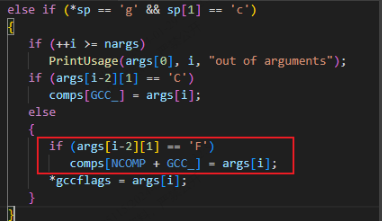

一、snowboy
snowboy不需要进行交叉编译，直接使用源文件提供的库，/(snowboy目录)/lib/rpi/libsnowboy-detect.a在arm板上使用，/(snowboy目录)/lib/ubuntu64/libsnowboy-detect.a在x86平台中使用。C用例可参考/(snowboy目录)/examples/C/demo.c。

1.相关文档
snowboy唤醒词设置路径：[https://snowboy.hahack.com/](https://snowboy.hahack.com/)

2.编译问题
1.在链库时，始终会有未定义问题，但实际上我们已经链接了libsnowboy-detect.a库，这里需要在CMake中添加定义：add\_compile\_options(-D\_GLIBCXX\_USE\_CXX11\_ABI=0)


二、ATLAS与Lapack
1.相关文档
atlas安装指南：[https://math-atlas.sourceforge.net/atlas\_install](https://math-atlas.sourceforge.net/atlas_install/node1.html)
lapack文档：[https://netlib.org/lapack/](https://netlib.org/lapack/)

2.编译命令
cd /(atlas目录)/ ;mkdir build; cd build

~~../configure --prefix=/home/samba\_share/WorkSpace/atlas/\_install --nof77 --with-netlib-lapack-tarfile=/home/samba\_share/WorkSpace/atlas/lapack-master.tgz -b 32 -C gc /home/samba\_share/rv1106\_s9/tools/linux/toolchain/arm-rockchip830-linux-uclibcgnueabihf/bin/arm-rockchip830-linux-uclibcgnueabihf-gcc --cc=arm-rockchip830-linux-uclibcgnueabihf-gcc -F gc '-g -w -fPIC' --cflags='-g -w -fPIC'~~

`../configure --prefix=/home/samba_share/WorkSpace/atlas/_install --cc=arm-rockchip830-linux-uclibcgnueabihf-gcc --with-netlib-lapack-tarfile=/home/samba_share/WorkSpace/atlas/lapack-master.tgz -b 32 -O 1 -A 55 -V 2048 -C ic arm-rockchip830-linux-uclibcgnueabihf-gcc -F ic '-g -w -mfpu=neon-vfpv4 -mfloat-abi=hard -O2' -C if arm-rockchip830-linux-uclibcgnueabihf-gfortran -F if '-g -w -mfpu=neon-vfpv4 -mfloat-abi=hard -O2' -C gc arm-rockchip830-linux-uclibcgnueabihf-gcc -F gc '-g -w -mfpu=neon-vfpv4 -mfloat-abi=hard -O2' `

需要合入支持gfortran的编译器进行编译，未合入编译器补丁：添加参数"-nof77"，不设置`-C if arm-rockchip830-linux-uclibcgnueabihf-gfortran -F if '-g -w -mfpu=neon-vfpv4 -mfloat-abi=hard -O2'`

\-b 32: 32位系统
\-O 1: linux
-A 55 : arma7
\-V 2048 : -mfpu=neon

3.编译问题
1.交叉编译时会生成xconfig并执行，执行xconfig时会查找动态库ld-uClibc.so.0和libc.so.0，但是很奇怪，这个库是交叉编译链中的，交叉编译生成的xconfig工具确可以在x86中执行。



因为这里使用的是绝对路径无法使用环境变量的方式让xconfig去指定路径查找ld-uClibc.so.0相关的库，所以需要在虚拟机中使用find命令查找到动态库ld-uClibc.so.0相关的库，拷贝到/lib目录中。

cp /home/samba\_share/rv1106\_s3l/tools/linux/toolchain/arm-rockchip830-linux-uclibcgnueabihf/arm-rockchip830-linux-uclibcgnueabihf/sysroot/lib/ld-uClibc.\* /lib -raf



xconfig不能加载libc.so.0库可以使用环境变量的方式解决。



`export LD_LIBRARY_PATH="/home/samba_share/rv1106_s3l/tools/linux/toolchain/arm-rockchip830-linux-uclibcgnueabihf/arm-rockchip830-linux-uclibcgnueabihf/sysroot/lib:$PATH"`

~~2.arm-rockchip830-linux-uclibcgnueabihf-gcc不识别-mfpmath=sse~~



将/(atlas目录)/CONFIG/src/atlcomp.txt文件中所有-mfpmath=sse标志删除

3.xconfig中不会对-F和-Fa的参数内容写到comp数组中


/(atlas目录)/CONFIG/src/config.c，1227行
```cpp
...
else if (*sp == 'g' && sp[1] == 'c')
{
    if (++i >= nargs)
        PrintUsage(args[0], i, "out of arguments");
    if (args[i-2][1] == 'C')
        comps[GCC_] = args[i];
    else
    {
        if (args[i-2][1] = 'F')
            comps[NCOMP+GCC_] = args[i];
        *gccflags = args[i];
    }
 }
...
```


