根据设备打印日志不难发现sip服务器下发的INVITE消息中是携带了y字段(十进制整数字符串，表示ssrc值)和f字段(编码格式、分辨率等信息)，但我们在回调函数中打印的sdp中并没又这两个字段的值。因为GB28181协议对SIP进行了拓展，所以我们需要对pjsip源码进行适当修改，使其对sdp支持的y,f,u字段。

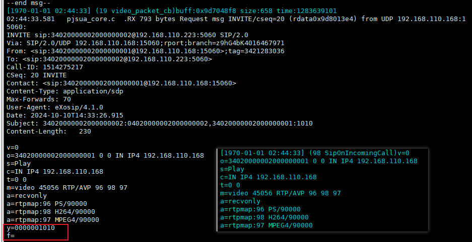

#### pjsip源码
(源码根目录)/pjmedia/include/pjmedia/sdp.h

struct pjmedia\_sdp\_session结构体增加参数：

```json
    pj_str_t    ssrc;               /**< ssrc (y=)                      */
    pj_str_t    fmt;                /**< format (f=)                    */
    pj_str_t    uri;                /**< uri (u=)                       */
```
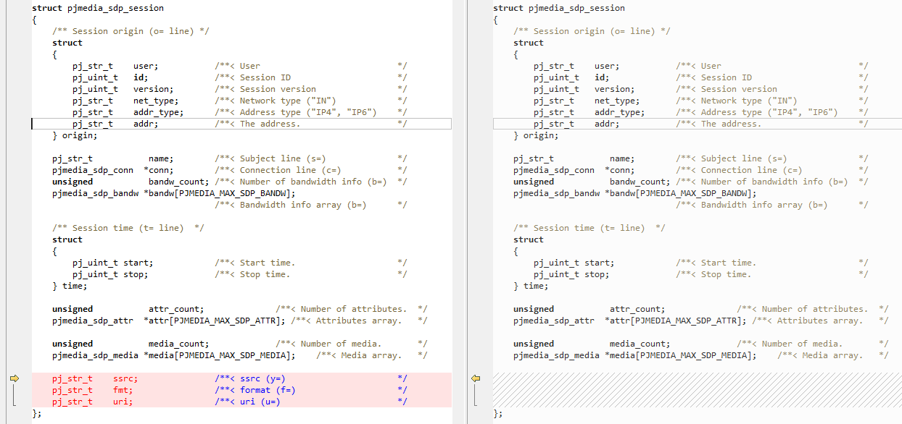

(源码根目录)/pjmedia/include/pjmedia/sdp.c

print\_session()中添加对y,f,u字段的内容打印：

```json
...
    /* Session uri (u=) line. */
    if (ses->uri.slen > 0) {
        *p++ = 'u';
        *p++ = '=';
        pj_memcpy(p, ses->uri.ptr, ses->uri.slen);
        p += ses->uri.slen;
        *p++ = '\r';
        *p++ = '\n';
    }
...
    /* Print ssrc (y=) lines. */
    *p++ = 'y';
    *p++ = '=';
    pj_memcpy(p, ses->ssrc.ptr, ses->ssrc.slen);
    p += ses->ssrc.slen;
    *p++ = '\r';
    *p++ = '\n';

    /* Print format (f=) lines. */
    *p++ = 'f';
    *p++ = '=';
    pj_memcpy(p, ses->fmt.ptr, ses->fmt.slen);
    p += ses->fmt.slen;
    *p++ = '\r';
    *p++ = '\n';
...
```
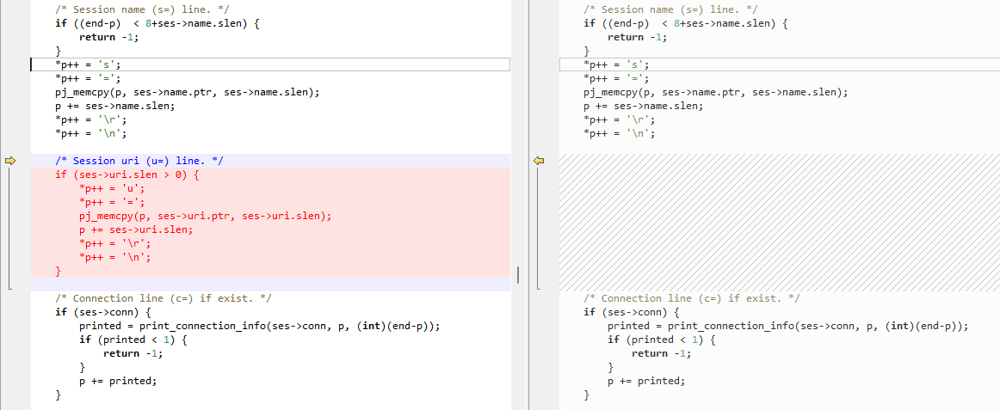

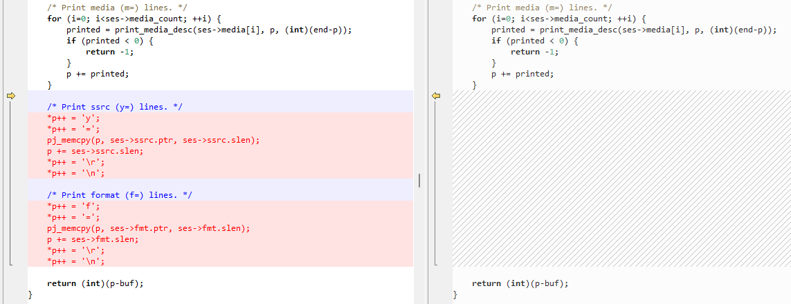

pjmedia\_sdp\_parse()中添加对y,f,u字段的内容解析：

```json
...
    case 'u':
        parse_generic_line(&scanner, &session->uri, &ctx);
        break;
...
    case 'y':
        parse_generic_line(&scanner, &session->ssrc, &ctx);
        break;
    case 'f':
        parse_generic_line(&scanner, &session->fmt, &ctx);
        break;
...
```
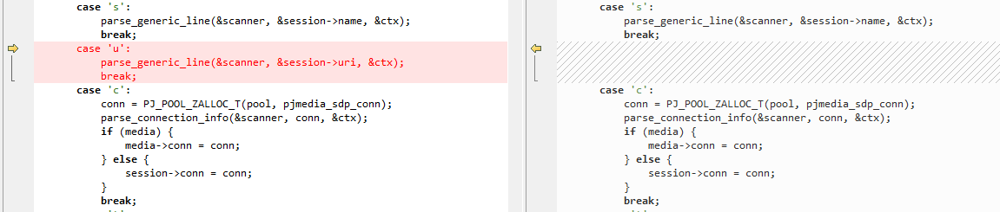

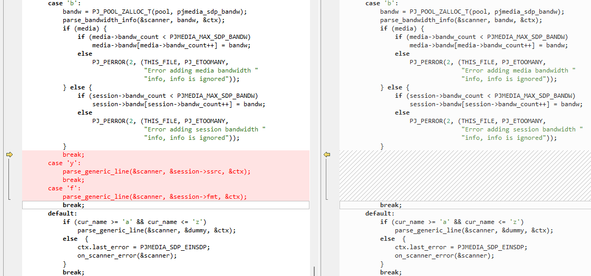

pjmedia\_sdp\_session\_clone()中添加对y,f,u字段的内容拷贝：

```json
...
    /* Clone uri,ssrc,format line. */
    pj_strdup(pool, &sess->uri, &rhs->uri);
    pj_strdup(pool, &sess->ssrc, &rhs->ssrc);
    pj_strdup(pool, &sess->fmt, &rhs->fmt);
...
```
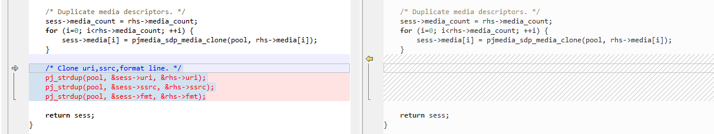

#### osip2源码
(源码根目录)/include/osipparser2/sdp\_message.h

struct sdp\_message结构体添加参数：

```cpp
struct sdp_message {
...
  char *y_ssrc;         /**< self add ssrc */
  char *f_format;       /**< self add format */
};
```
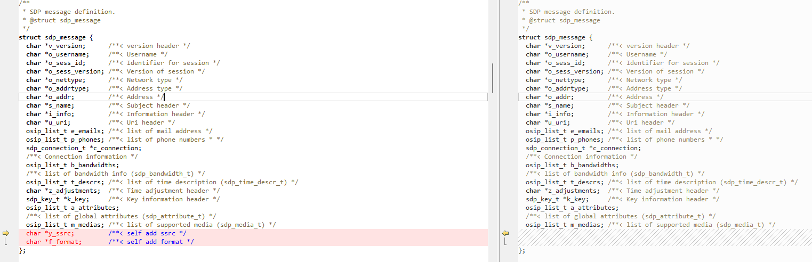

(源码根目录)/src/osipparser2/sdp\_message.c

添加函数sdp\_message\_parse\_y()，sdp\_message\_parse\_f()解析相应字段并调用；解析media之后如果解析失败跳出循环，不直接退出函数，防止未去解析ssrc和format：

```cpp
...
static int sdp_message_parse_y(sdp_message_t *sdp, char *buf, char **next);
static int sdp_message_parse_f(sdp_message_t *sdp, char *buf, char **next);
...
...
static int sdp_message_parse_y(sdp_message_t *sdp, char *buf, char **next) {
  char *equal;
  char *crlf;

  *next = buf;

  equal = buf;

  while ((*equal != '=') && (*equal != '\0'))
    equal++;

  if (*equal == '\0')
    return ERR_ERROR;

  /* check if header is "y" */
  if (equal[-1] != 'y')
    return ERR_DISCARD;

  crlf = equal + 1;

  while ((*crlf != '\r') && (*crlf != '\n') && (*crlf != '\0'))
    crlf++;

  if (*crlf == '\0')
    return ERR_ERROR;

  if (crlf == equal + 1)
    return ERR_ERROR; /* u=\r ?? bad header */

  /* y=ssrc */
  sdp->y_ssrc = osip_malloc(crlf - (equal + 1) + 1);

  if (sdp->y_ssrc == NULL)
    return OSIP_NOMEM;

  osip_strncpy(sdp->y_ssrc, equal + 1, crlf - (equal + 1));

  if (crlf[1] == '\n')
    *next = crlf + 2;

  else
    *next = crlf + 1;

  return OSIP_WF;
}

static int sdp_message_parse_f(sdp_message_t *sdp, char *buf, char **next) {
  char *equal;
  char *crlf;

  *next = buf;

  equal = buf;

  while ((*equal != '=') && (*equal != '\0'))
    equal++;

  if (*equal == '\0')
    return ERR_ERROR;

  /* check if header is "f" */
  if (equal[-1] != 'f')
    return ERR_DISCARD;

  crlf = equal + 1;

  while ((*crlf != '\r') && (*crlf != '\n') && (*crlf != '\0'))
    crlf++;

  if (*crlf == '\0')
    return ERR_ERROR;

  if (crlf == equal + 1)
    return ERR_ERROR; /* u=\r ?? bad header */

  /* f=format */
  sdp->f_format = osip_malloc(crlf - (equal + 1) + 1);

  if (sdp->f_format == NULL)
    return OSIP_NOMEM;

  osip_strncpy(sdp->f_format, equal + 1, crlf - (equal + 1));

  if (crlf[1] == '\n')
    *next = crlf + 2;

  else
    *next = crlf + 1;

  return OSIP_WF;
}
...
int sdp_message_parse(sdp_message_t *sdp, const char *buf) {
...
      if (more_m_header == -1) /* header is bad */
        break;
...
...
  i = sdp_message_parse_y(sdp, ptr, &next_buf);

  if (i == -1) /* header is bad */
    return -1;

  ptr = next_buf;

  i = sdp_message_parse_f(sdp, ptr, &next_buf);

  if (i == -1) /* header is bad */
    return -1;

  ptr = next_buf;
...
}
```
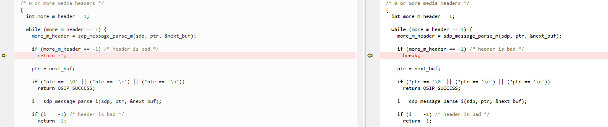


sdp\_message\_init() 中添加初始化

```cpp
...
  (*sdp)->y_ssrc = NULL;
  (*sdp)->f_format = NULL;
...
```
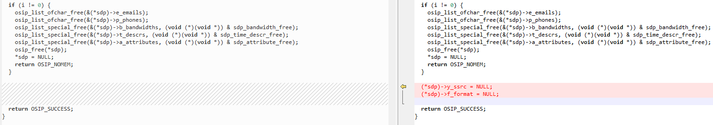

sdp\_message\_to\_str()中添加对ssrc和format转字符串：

```cpp
...
  if (sdp->y_ssrc != NULL) {
    tmp = __osip_sdp_append_string(&string, &size, tmp, "y=");
    tmp = __osip_sdp_append_string(&string, &size, tmp, sdp->y_ssrc);
    tmp = __osip_sdp_append_string(&string, &size, tmp, OSIP_CRLF);
  }

  if (sdp->f_format != NULL) {
    tmp = __osip_sdp_append_string(&string, &size, tmp, "y=");
    tmp = __osip_sdp_append_string(&string, &size, tmp, sdp->f_format);
    tmp = __osip_sdp_append_string(&string, &size, tmp, OSIP_CRLF);
  }
...
```
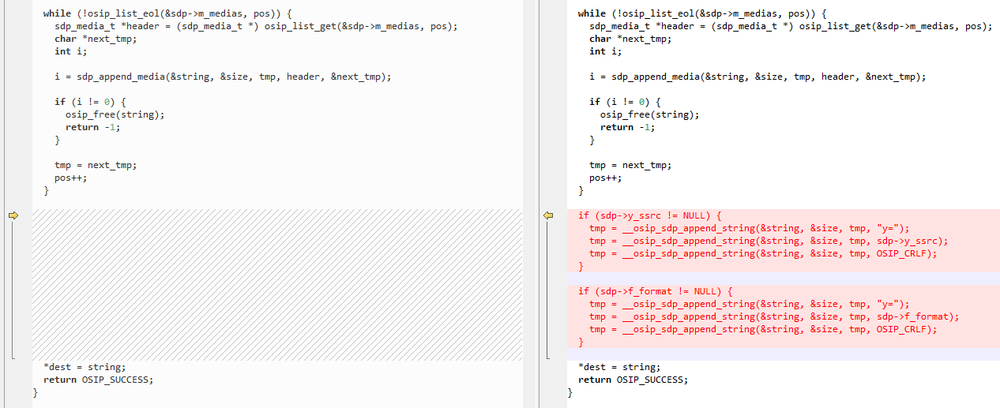

sdp\_message\_free()中释放对ssrc和format空间：

```cpp
...
  osip_free(sdp->y_ssrc);
  osip_free(sdp->f_format);
...
```


