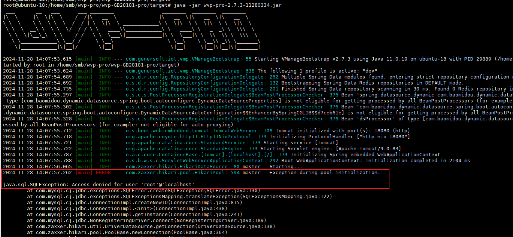
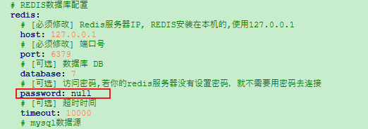
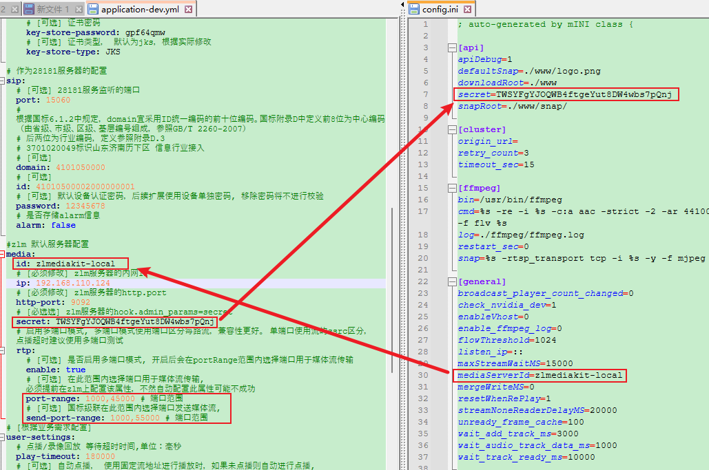

[wvp-pro使用文档](https://doc.wvp-pro.cn/#/_content/introduction/compile)

[ZLMediaKit使用教程](https://github.com/ZLMediaKit/ZLMediaKit/wiki)

#### MySQL初始化校验失败问题


```plsql
// 创建线程库
CREATE DATABASE wvp;
CREATE USER root@'localhost' IDENTIFIED BY '123456';
GRANT ALL PRIVILEGES ON wvp.* TO root@'localhost';
FLUSH PRIVILEGES;

// 查看用户和主机信息
SELECT user, host FROM mysql.user;

// 更新用户密码
ALTER USER root@'localhost' IDENTIFIED WITH mysql_native_password BY '123456';
FLUSH PRIVILEGES;

exit
```
可使用命令行`mysql -h 127.0.0.1 -u root -p wvp`校验root用户权限

#### 配置参数修改
配置文件路径：

/(wvp-pro根目录)/target/application-dev.yml

/(ZLMediaKit根目录)/release/linux/Debug/config.ini



redis数据库没有密码，wvp-pro配置文件application-dev.yml中redis.password修改为null



wvp-pro配置文件application-dev.yml中的media.id与zlmediakit配置文件config.ini中的general.mediaServerId保持一致，否则无法正常预览视频

wvp-pro配置文件application-dev.yml中的media.secret与zlmediakit配置文件config.ini中的api.secret保持一致

wvp-pro配置文件application-dev.yml修改rtp端口范围