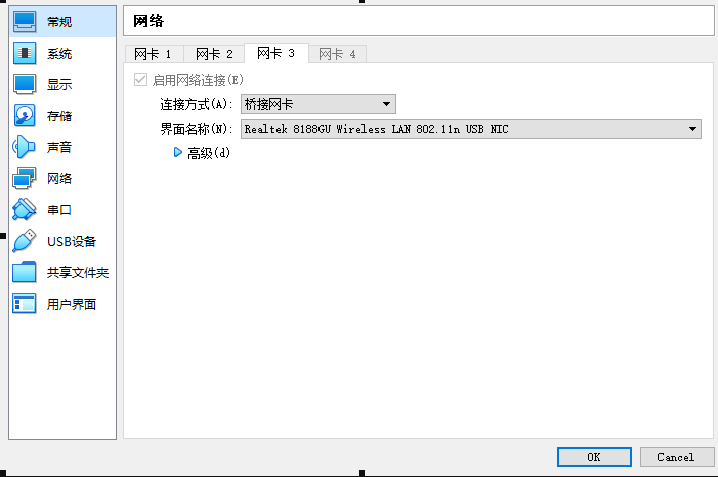
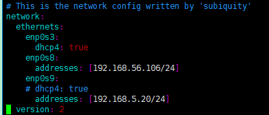

1.根据以下链接配置nfs svr
https://www.cnblogs.com/jzcn/p/14808681.html

2.virtual box 给虚拟机添加网卡桥接

3修改./etc/netplan/00-installer-config.yaml，设置合适的网卡ip

4.设备端挂载命令
`mount -t nfs -o nolock 192.168.5.20:/home/samba\_share/nfsdir /root`