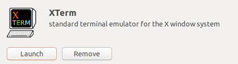
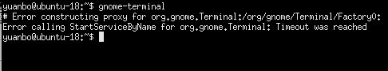

现象：点击terminal之后，虚拟机尝试打开终端，但始终打开失败。

解决：
1.由于无法打开terminal，无法输入命令行，在Ubuntu software中下载XTerm

2.在XTerm中执行命令“gnome-terminal”，发现报错

3.执行命令 `localectl set-locale LANG="en_US.UTF-8"`设置语言格式，重启虚拟机

参考：
[https://blog.51cto.com/u\_847102/5261410](https://blog.51cto.com/u_847102/5261410)