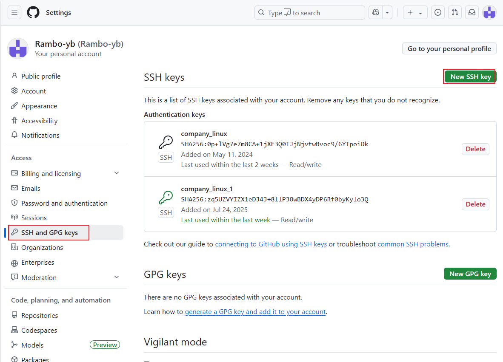

1.配置git
`apt install git`
`git config --global user.name "Rambo-yb"`
`git config --global user.email "939568338@qq.com"`

2.生成ssh key
`ssh-keygen -t rsa -C "939568338@qq.com"`

3.添加ssh key
将/root/.ssh/id\_rsa.pub中的公钥内容添加到github的SSH key中

参考：
[Linux 下建立 Git 与 GitHub 的连接 - woider - 博客园 (cnblogs.com)](https://www.cnblogs.com/woider/p/6533709.html)