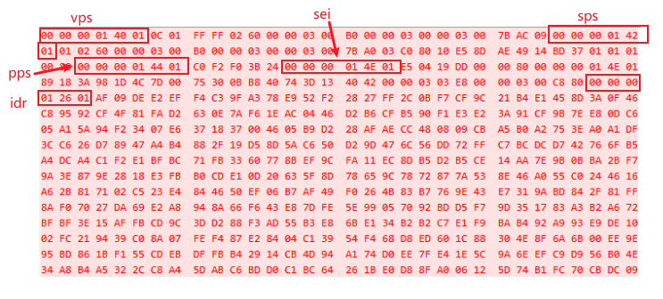

#### 基础概念
与H.264/AVC类似，H.265/HEVC（ High Efficiency Video Coding）采用了视频编码层（Video Code Layer，VCL）和网络适配层（Network Abstract Layer，NAL），原始视频经过VCL层，被编码成视频数据，然后经过NAL层，封装成一个个NAL包以适应不同网络的视频传输。HEVC码流在应用过程中与H.264/AVC码流的区别就在于NAL层；NAL单元的头部容量从H.264/AVC的单字节扩充为两个字节，增加的内容主要用于标识它所装载数据的类型。

#### 帧头解析


nal unit header：

```Plain Text
0  1 2 3 4 5 6 7 0 1 2 3 4 5 6 7   
+-+-----------+-----------+-----+
|F|    Type   |  LayerId  | TID |
+-+-----------+-----------+-----+

通常情况，F为0(1bit)，type(6bit)，LayerId为0(6bit)，TID为1(3bit)
H265帧类型判断：int type = (code & 0x7e) >> 1;

常见帧头:
VPS: 40 01
SPS: 42 01
PPS: 44 01
SEI: 4E 01
IDR: 26 01
P  : 02 01
```


官方文档下载：

[https://www.itu.int/rec/T-REC-H.265](https://www.itu.int/rec/T-REC-H.265)


