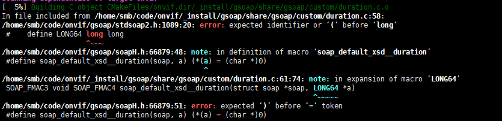
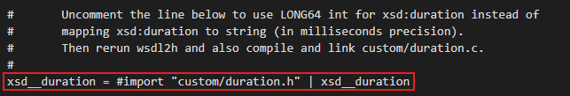
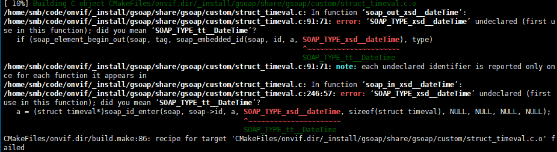
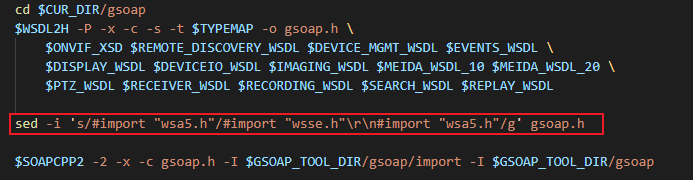

#### typemap.bat修改
/custom/duration.c文件报错：

1.未知的LONG64类型

2.soap\_default\_xsd\_\_duration函数被定义未宏

将typemap.bat中,此处注释的关于xsd\_duration的内容放开。

#### 鉴权编译问题
1.编译中会包struct\_timeval.c中找不到关于‘SOAP\_TYPE\_xsd\_\_dateTime’的申明(有其他方法解决此问题，但是依旧回报第二个问题)

2.编译中会包wsseapi.h中找不到关于struct ds\_\_KeyInfoType的定义

需要在生成gsoap.h头文件后，在文件中添加#include "wsse.h"。

