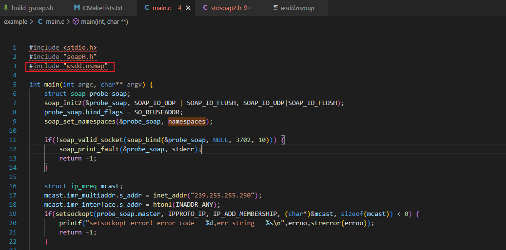
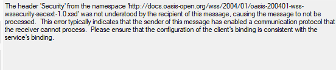
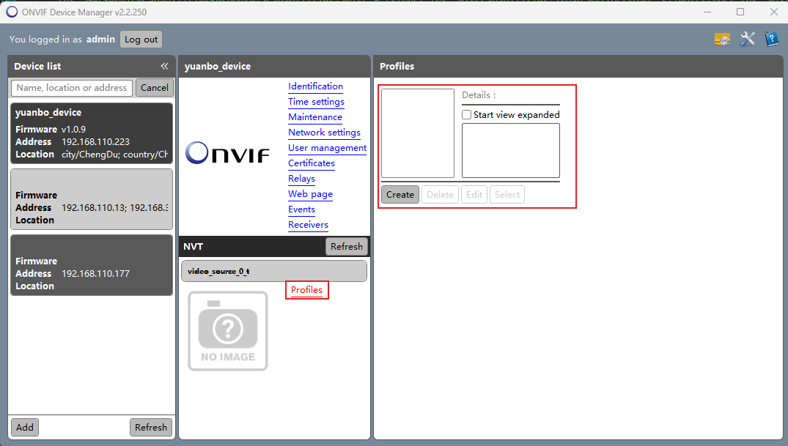
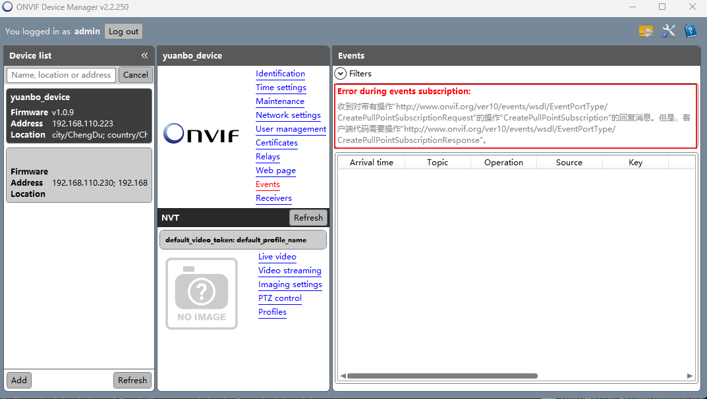
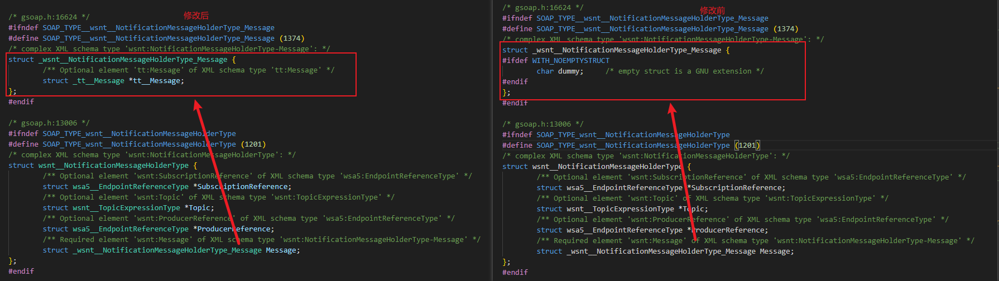
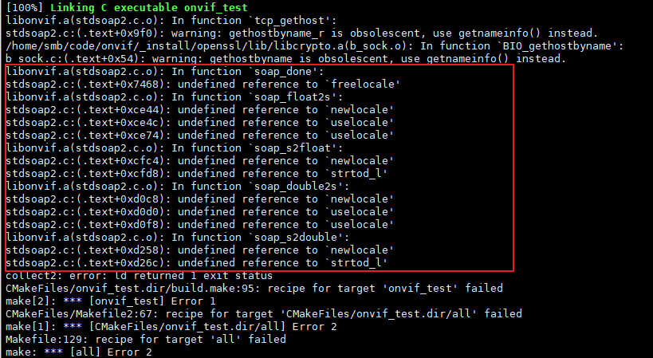

#### 关联命名空间
在gsoap的头文件stdsoap.h中，有"extern SOAP\_NMAC struct Namespace namespaces\[\];"的定义申明，但没有定义实现。且构建的代码框架不同，namespaces的定义实现不同。想要应用程序能正常编译，需要自行包含"/(代码框架路径)/wsdd.nsmap"文件：#include "wsdd.nsmap"。

#### 无法解析带有Security回复
客户端发送带有用户名密码的消息到服务端，如果服务端没有进行密码校验直接回复消息，回复的消息头中会携带<wsse:Security SOAP-ENV:mustUnderstand="true">内容。客户端如果未支持此类消息的解析，就会有下图中的报错：

#### NVT无内容
Onvif Device Manager工具无法解析服务端回复的profiles结果。使用Onvif Device Test Tool工具能够正常解析出profiles内容。

通过GetVideoSources获取到的token需要和GetProfiles的某一项profile的sourcetoken进行匹配，否则无法显示视频信息其他选项

#### 事件PullPointSubscriptionResponse报错
在PullPointSubscription请求消息交互过程中，soap header中会携带wsa:action http://www.onvif.org/ver10/events/wsdl/EventPortType/CreatePullPointSubscriptionRequest 但是客户端接收回复消息不能识别action为CreatePullPointSubscriptionRequest，需要在回复消息时，将CreatePullPointSubscriptionRequest修改为CreatePullPointSubscriptionResponse.

注：event相关消息，都需要将消息头中的request修改为response，否则客户端无法解析

#### PullMessageResponse无法携带消息
PullMessageResponse回复结构体中Message为空结构体，导致回复消息无法和官方文档实例xml一样携带事件通知信息。

在typemap.bat中，结尾的位置添加"\_wsnt\_\_NotificationMessageHolderType\_Message = \$ struct \_tt\_\_Message\* tt\_\_Message;"，给空结构体添加参数，用于携带事件通知消息。

参考：[Onvif协议学习：13、遮挡报警\_onvif 协议分析-CSDN博客](https://blog.csdn.net/weixin_39510813/article/details/115183879)

#### 编译器不支持locale.h
onvif协议为上层协议，切换编译器能正常编译用例。部分编译器程序编译的时候会找不到freelocale等函数实现。

gsoap执行./configure的时候携带参数"--disable-c-locale"，同时，在编译用例的时候添加"-DWITH\_NO\_C\_LOCALE"

