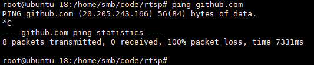

解决方法：
通过网址[https://www.ipaddress.com/website/github.com/](https://www.ipaddress.com/website/github.com/)查询github.com的ip地址

修改Ubuntu中/etc/hosts文件

参考：
[https://blog.csdn.net/see\_sunrise/article/details/143857310](https://blog.csdn.net/see_sunrise/article/details/143857310)