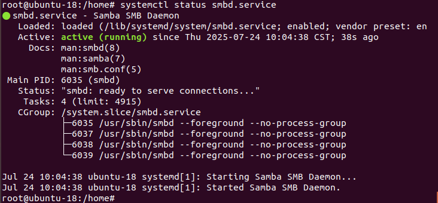

1.安装samba软件
`apt update`
`apt install samba -y`

2.创建共享文件夹
`mkdir -p /home/smb`
`chmod 0777 /home/smb -R`

3.修改samba配置文件
`vim /etc/samba/smb.conf`
```Plain Text
[yuanbo]
    comment = smb
    path = /home/smb
    writable = yes
    available = yes
    browseable = yes
    valid users = yuanbo
```

4.设置samba
`smbpasswd -a yuanbo`
用户名与配置中的valid user需要一致

5.重启samba
`systemctl restart smbd.service`
`systemctl enable smbd.service`
查看samba运行状态 `systemctl status smbd.servic` 


参考：
[基于Ubuntu22.04的Samba服务器搭建教程（新手保姆级教程）\_ubuntu samba-CSDN博客](https://blog.csdn.net/qq_42417071/article/details/136328807)