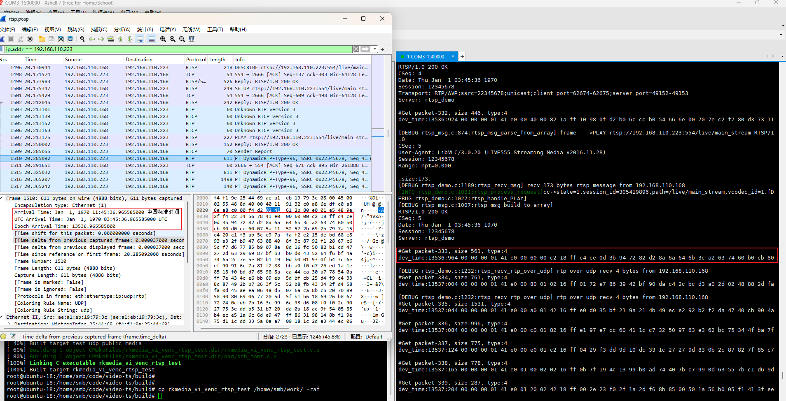
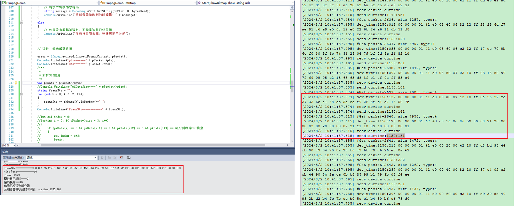

#### 一、rtsp预览延迟
验证方案：利用手机录像录入两个手指合拢的过程，通过" '预览视频中手指合拢时间'-'实际手指合拢时间'='预览延迟' "的方法验证

验证结果：使用EasyPlayer预览延迟在200ms左右，使用VLC预览延迟在400ms左右

| 播放器        | 实际合拢(s) | 预览合拢(s) | 时间差(s) | 结论           |
| ---------- | ------- | ------- | ------ | ------------ |
| EasyPlayer | 31.913  | 32.129  | 0.216  | 预览延迟在200ms左右 |
|            | 34.303  | 34.518  | 0.215  |              |
|            | 37.351  | 37.564  | 0.213  |              |
|            | 39.844  | 40.036  | 0.192  |              |
|            | 42.826  | 43.043  | 0.217  |              |
| VLC        | 67.362  | 67.765  | 0.403  | 预览延迟在400ms左右 |
|            | 70.091  | 70.485  | 0.394  |              |
|            | 74.610  | 75.022  | 0.412  |              |
|            | 78.039  | 78.451  | 0.412  |              |
|            | 81.244  | 81.638  | 0.394  |              |

#### 二、rtsp传输延迟
##### 1.设备端抓包验证
验证方案：

1)每次通过rtsp库发送码流之前，打印设备当前时间和发送的数据前32字节内容

2)使用tcpdump工具再设备端进行抓包

验证结果：rtsp传输过程延迟1ms左右

      因为rtsp库中做了处理，所以抓包过程中没有00 00 00 01字段出现，从41 e0开始进行数据对比确定设备端在"113536:964"这个时间点发出数据。抓包文件中找到相同数据后，可以看到数据的到达时间"Epoch Arrival Time: 13536.965585000"。二者的时间差为1ms，因为设备端打印时精度单位为1ms，所以可能存在1ms误差。

PS.因为PC端和设备之间始终存在时间误差，所以在设备端进行抓包，降低时间因素导致的误差。

##### 2.PC与设备时间差验证
验证方案：

1)每次通过rtsp库发送码流之前，打印设备当前时间和发送的数据前32字节内容；

2)设备与播放器之间添加一条TCP连接，在播放器收到一帧数据之后，使用TCP连接获取设备端当前时间，打印数据前32字节内容和设备时间。

验证结果：rtsp传输过程延迟低于4ms

       PC端frameStr中的具体数据内容和我们设备端dev\_time:1150:137之后的具体数据一致，所以设备端是在设备时间"1150:137"发送的这一帧数据。另外，因为PC端是先打印的时间，再打印的32字节数据，所以这里显示的时间"curtime:1150:181"为下一帧获取的时间，结合设备端打印"curtime:1150:181"之前的数据，可以确定PC端接收数据是获取到的设备时间为"curtime:1150:141"。"1153:137"与"1150:141"之间的时间差为4ms，因为两个时间之间涉及到一次rtsp数据传输和一次tcp数据交互，所以推断rtsp数据传输过程低于4ms。

#### 三、编码延迟
