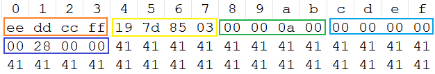
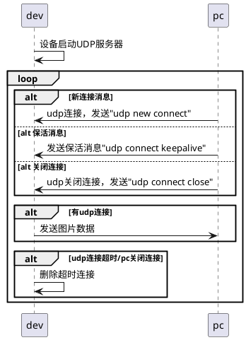

#### UDP传输协议
由于每张完整的图片大小为512x640x2的数据长度，udp单次不能完整发送整张图片，故将图片按10k进行拆分，再加上20字节的自定义帧头。udp每次发送数据长度：20+10240字节。

EE DD CC FF :帧头标志
19 7D 85 03 :时间戳
00 00 0A 00 :数据总长度
00 00 00 00 :数据偏移，当前数据块在整张图中的位置
00 28 00 00 :当前数据段长度

#### 时序图

