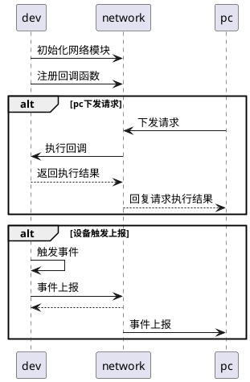
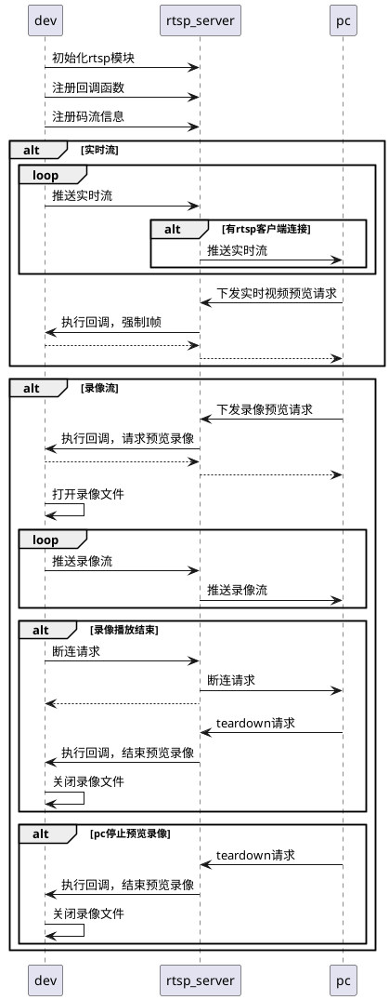
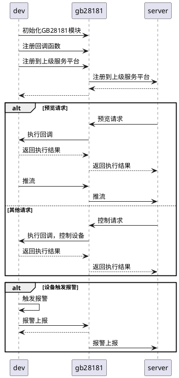

### HTTP协议
#### API说明
##### 函数说明
- `int NetworkInit(NetworkInitialInfo* info)` 初始化接口
- `void NetworkUnInit()` 反初始化接口
- `void NetworkOperationRegister(NetworkOperationType type, void* cb)` 回调注册接口
- `int NetworkUploadInfo(NetworkUpload* upload_info)` 信息上报接口
##### 回调说明
- `typedef int (*NetworkOperationGetAbilityCb)(NetworkAbilitySupportFunction* )` 获取设备能力回调
- `typedef int (*NetworkOperationSystemCb)(NetworkSystem* )` 系统请求回调
- `typedef int (*NetworkOperationGetConfigCb)(int , void* , int )` 获取配置回调
- `typedef int (*NetworkOperationSetConfigCb)(int , void* , int )` 设置配置回调
- `typedef int (*NetworkOperationControlCb)(int, int, void*, int)` 控制请求回调
- `typedef int (*NetworkOperationUpgradeCb)(NetworkUpgradeInfo* )` 升级回调
-  `typedef int (*NetworkOperationTransparentTransmissionCb)(NetworkTransparentTransmission*)` 透传回调
- `typedef int (*NetworkOperationInternalCb)(int, int, void*, int);` 内部请求回调
#### 使用流程

#### 用例介绍
``` C
int GetAbility(NetworkAbilitySupportFunction* func) {
	func->camera_ir_funcs.num = 1;
	// 通知上位机，支持设备支持红热/黑热/铁红/彩虹
	func->camera_ir_funcs.camera_ir[0].camera_ir_image_info.pseudo_color_support_mask = (1 << NETWORK_PSEUDO_COLOR_WHITE_HOT) | (1 << NETWORK_PSEUDO_COLOR_BLACK_HOT) | (1 << NETWORK_PSEUDO_COLOR_IRON_RED) | (1 << NETWORK_PSEUDO_COLOR_RAINBOW);
	return 0;
}

int GetConfig(int type, void* conf, int size) {
	if (type == NETWORK_CONFIG_CAMERA_IR_IMAGE_INFO) {
		NetworkConfigCameraIrImageInfos* _st = (NetworkConfigCameraIrImageInfos*)conf; 
		if(_st->deal_num == -1) { 
			NetworkConfigCameraIrImageInfos all_image_infos;
			// todo 获取所有视频通道的图像信息
			// ... 
			memcpy(_st, &all_image_infos, sizeof(all_image_infos)); 
		} else if (_st->deal_num < NETWORK_CAMERA_MAX_NUM) {
			NetworkConfigCameraIrImageInfo image_info;
			// todo 获取第_st->deal_num通道的图像信息
			// ...
			_st->num = 1; 
			memcpy(&_st->image_info[0], &image_info, sizeof(image_info)); 
		}
	} else {
		return -1;
	}
	return 0;
}

int SetConfig(int type, void* conf, int size) {
	if (type == NETWORK_CONFIG_CAMERA_IR_IMAGE_INFO) {
		NetworkConfigCameraIrImageInfos* _st = (NetworkConfigCameraIrImageInfos*)conf; 
		if(_st->deal_num == -1) { 
			NetworkConfigCameraIrImageInfos all_image_infos;
			memcpy(&all_image_infos, _st, sizeof(all_image_infos));
			// todo 设置所有视频通道的图像信息
			// ... 
		} else if (_st->deal_num < NETWORK_CAMERA_MAX_NUM) {
			NetworkConfigCameraIrImageInfo image_info;
			memcpy(&image_info, &_st->image_info[0], sizeof(image_info)); 
			// todo 设置第_st->deal_num通道的图像信息
			// ...
		}
	} else {
		return -1;
	}
	return 0;
}

int main (int argc, char** argv) {
	// 初始化网络模块，使用默认路径
	NetworkInit(NULL);
	
	// 注册回调接口
	NetworkOperationRegister(NETWORK_OPERATION_GET_ABILITY, GetAbility);
	NetworkOperationRegister(NETWORK_OPERATION_GET_CONFIG, GetConfig);
	NetworkOperationRegister(NETWORK_OPERATION_SET_CONFIG, SetConfig);
	
	while(1) {
		sleep(1);
	}
	return 0;
}
```
### RTSP协议
#### API说明
##### 函数说明
- `int RtspServerInit(const char* log_path, const char* config_path)` 初始化接口
- `int RtspServerUnInit()` 反初始化接口
- `void RtspServerStreamingRegister(RtspServerStreamingRegisterInfo* info, unsigned int size)` 码流注册接口
- `int RtspServerPushStream(RtspServerPushStreamInfo* info)` 推流接口
- `void RtspServerOperationRegister(void* cb)` 回调注册函数
- `int RtspServerGetUrl(int chn, int stream_type, const char* addr, char* url, int size)` 实时流预览地址获取
- `int RtspServerGetPreviewStatus()` 实时流预览状态
- `int RtspServerSendBye(int chn, int stream_type)` 断连请求
##### 回调说明
- `typedef int (*RtspServerOperationCb)(int, void* )` 控制回调
#### 使用流程

#### 用例介绍
```c
static void* PushStream(void* arg) {
	while (1) {
		unsigned char* stream_pkt = NULL;
		int stream_size = 0;
		uint64_t stream_pts = 0;
		// todo 获取码流
		
		RtspServerPushStreamInfo info = {0};
		info.chn = 0;
		info.stream_type = RTSP_SERVER_STREAMING_MAIN;
		info.buff = stream_pkt;
		info.size = stream_size;
		info.pts = stream_pts;
	    RtspServerPushStream(&info);
	}
}

int OperationCb(int type, void* st) {
	if (type == RTSP_SERVER_OPERATION_RECORDING) {
		// todo
	} else if (type == RTSP_SERVER_OPERATION_FORCE_IDR) {
		// todo
	}

	return 0;
}

int main (int argc, char** argv) {
	RtspServerInit(NULL, NULL);
	RtspServerOperationRegister((void*)OperationCb);
	
	RtspServerStreamingRegisterInfo info[2] = {
		// 实时流
		{
			.chn = 0, 
			.stream_type = RTSP_SERVER_STREAMING_MAIN, 
			.video_info = {.use = 1, .video_type = RTSP_SERVER_VIDEO_H264, .fps = 25}
		},
		// 录像流
		{
			.chn = -1, 
			.stream_type = RTSP_SERVER_STREAMING_MAIN, 
			.video_info = {.use = 1, .video_type = RTSP_SERVER_VIDEO_H264, .fps = 30}, 
			.audio_info = {.use = 1, .audio_type = RTSP_SERVER_AUDIO_AAC, .sample_rate = 16000, .channels = 2}
		},
	};
	RtspServerStreamingRegister(info, 2);
	
	pthread_t thread_id;
	pthread_create(&thread_id, NULL, PushStream, NULL);
	
	while(1) {
		sleep(1);
	}
	
	return 0;
}
```
#### URL定义
```python
1.实时视频流
rtsp://<ip>:<port>/streaming/<id>?auth=<username>:<password>&<param>
<ip>:设备ip
<port>:rtsp端口
<id>:通道号 通道*100+码流类型
<username>:用户名(预留)，默认:admin
<password>:密码(预留)，默认:123456
<param>:扩展内容，便于后期扩展
例：rtsp://192.168.110.223:554/streaming/001?auth=admin:123456

2.回放视频流
rtsp://<ip>:<port>/recording/<id>?auth=<username>:<password>&<param>
<id>:通道号 通道*100+1
<param>:
1) record_file=<filename>&offset_time=<second>:通过指定文件进行录像回放,offset_time：从文件开始时间多少秒开始播放
2) start_time=<time>&end_time=<time>:通过指定时间段进行录像回放，<time>:时间 20250220T000159
例：
rtsp://192.168.110.223:554/recording/001?auth=admin:123456&record_file=test.mp4&offset_time=0
rtsp://192.168.110.223:554/recording/101?auth=admin:123456&start_time=20250826T100000&end_time=20250826T110000

注：
码流类型：【1：主码流】【2：子码流】
回放视频流：同一时间只允许一个用户预览回放录像
```
### ONVIF协议
#### API说明
##### 函数说明
- `int OnvifInit(OnvifInitialInfo* info)` 初始化接口
- `int OnvifUnInit()` 反初始化接口
- `void OnvifOperationRegister(OnvifOperationType type, void* cb)` 回调注册接口
- `void OnvifEventUplaod(OnvifEventInfo* info)` 事件上报接口
##### 回调说明
- `typedef int (*OnvifOperationSystemCb)(OnvifSystem*)` 系统请求回调
- `typedef int (*OnvifOperationGetConfigCb)(int , void* , int )` 获取配置回调
- `typedef int (*OnvifOperationSetConfigCb)(int , void* , int )` 设置配置回调
- `typedef int (*OnvifOperationControlCb)(int, int, void*, int)` 控制请求回调
### GB28181协议
#### API说明
##### 函数说明
- `int Gb28181Init(Gb28181InitialInfo* info)` 初始化接口
- `void Gb28181UnInit()` 反初始化接口
- `void Gb28181OperationRegister(int type, void* cb)` 回调注册接口
- `int Gb28181Register(Gb28181Info* info)` 注册到上层服务平台接口
- `int Gb28181Unregister(Gb28181Info* info)` 注销上层服务平台连接
- `int Gb28181PushStream(Gb28181PushStreamInfo* info)` 推流接口
- `int Gb28181PushAlarm(Gb28181AlarmInfo* info)` 报警上报接口
##### 回调说明
- `typedef int (*Gb28181OperationControlCb)(int, void*, int)` 控制请求回调
#### 使用流程

#### 用例介绍
```c
static void* PushStream(void* arg) {
	while (1) {
		unsigned char* stream_pkt = NULL;
		int stream_size = 0;
		uint64_t stream_pts = 0;
		// todo 获取码流
		
		if (kMng.play_stream[0]) {
			Gb28181PushStreamInfo info;
			info.type = GB28181_PUSH_REAL_TIME_STREAM;
			snprintf(info.chn_id, sizeof(info.chn_id), CHN_ID_0);
			info.buff = stream_pkt;
			info.size = stream_size;
			info.pts = stream_pts;
	    	Gb28181PushStream(&info); 
		}
	}
}

static int ContorlProc(int type, void* st, int size) {
	switch (type) {
	case GB28181_CONTORL_PLAY_STREAM:
		if (((Gb28181PlayStream*)st)->type == GB28181_PLAY_VIDEO_START) {
			if (strcmp(((Gb28181PlayStream*)st)->chn_id, CHN_ID_0) == 0) {
				kMng.play_stream[0] = true;
			} else if (strcmp(((Gb28181PlayStream*)st)->chn_id, CHN_ID_1) == 0) {
				kMng.play_stream[1] = true;
			}
			
		} else {
			if (strcmp(((Gb28181PlayStream*)st)->chn_id, CHN_ID_0) == 0) {
				kMng.play_stream[0] = false;
			} else if (strcmp(((Gb28181PlayStream*)st)->chn_id, CHN_ID_1) == 0) {
				kMng.play_stream[1] = false;
			}
		}
		break;
	default:
		break;
	}
	return 0;
}

int main(int argc, char** argv) {
	Gb28181Init(NULL);
	Gb28181OperationRegister(GB28181_OPERATION_CONTROL, (void*)ContorlProc);
	
	Gb28181Info info;
	snprintf(info.sip_id, sizeof(info.sip_id), "41010500002000000001");
	snprintf(info.sip_domain, sizeof(info.sip_domain), "4101050000");
	snprintf(info.sip_addr, sizeof(info.sip_addr), "192.168.110.124");
	info.sip_port = 15060;
	snprintf(info.sip_username, sizeof(info.sip_username), "41010500002000000002");
	snprintf(info.sip_password, sizeof(info.sip_password), "12345678");
	info.register_valid = 2*60*60;
	info.keeplive_interval = 60;
	info.max_timeout = 3;
	info.register_inretval = 60;
	info.chn_max_num = 2;
	snprintf(info.chn_id[0], sizeof(info.chn_id[0]), CHN_ID_0);
	snprintf(info.chn_id[1], sizeof(info.chn_id[1]), CHN_ID_1);
    Gb28181Register(&info);
    
    pthread_t thread_id;
	pthread_create(&thread_id, NULL, PushStream, NULL);
    
    while (1){
        sleep(1);
    }
    
    return 0;
}
```
